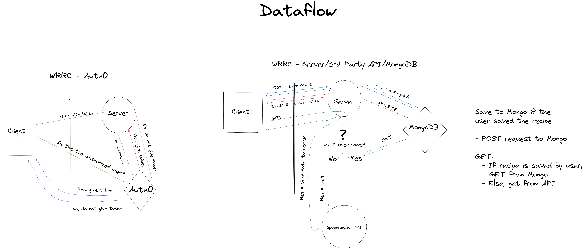

# Software Requirements

## Vision

- The vision of My Kitchen is to create an app that allows users to enter their available ingredients and receive a variety of recipes that incorporate them, and provide complementary wine pairings.
- My Kitchen aims to solve the logistical dilemma of using remaining pantry items and incorporating them into delicious recipes with wine pairing suggestions.
- Food waste is both economically and environmentally costly. Approximately one-third of the global food produced is lost or wasted, a whopping 1.3 billion tonnes! In the United States alone, an estimated 30-40% of food is wasted. By allowing users to fully utilize their pantry ingredients, My Kitchen provides the common household an easy, convenient way to reduce their food waste.

## Scope (In/Out)

- In: What My Kitchen will do
  - The app will have a text input for users to enter their available ingredients
  - Using the entered ingredients, the app will then display various recipes which utilize said ingredients.
  - Users will be able to save their favorite recipes to their profiles.
  - Upon clicking a displayed recipe, a modal will render, detailing a picture of the dish and recipe information.
- Out: What My Kitchen will not do
  - Provide mixed drink recipes; My kitchen will provide the user with wine pairings for recipes, but will not provide recipes for mixed drinks
  - The site will not turn into an Android/iOS app

## MVP

- MVP functionalities:
  - Use of MongoDB to store user data
  - Use of Auth0 for secure access
  - Min 3 pages on frontend
    - 2 pages must accept and process user input
    - 1 page for About Us
  - Use of React and React bootstrap for frontend
  - Use of Express/Node.js for backend
- Stretch Goals:
  - Add ability for users to rate recipes
  - Add dietary restrictions to filter out recipes

### Functional Requirements

- User can
  - search for recipes based on specific ingredients
  - save recipes to their profile
  - access their saved recipes, and remove them if desired

- Data Flow:

### Non-Functional Requirements

- Security: The user's saved recipes should only be accessible to them e.g another user cannot delete them.
  - This will be accomplished via implementation of Auth0 with CRUD operations
- Usability: The site should be easy to navigate with intuitive interaction points
  - The site will have easy to read font/color contrast, nav links where users expect them, and well labeled buttons.
- Reliability: The server and 3rd party API should reliably return client requested resources
  - The server will appropriately groom data from the 3rd party API for the client app. The client app will filter and appropriately package data to be sent to the server.
